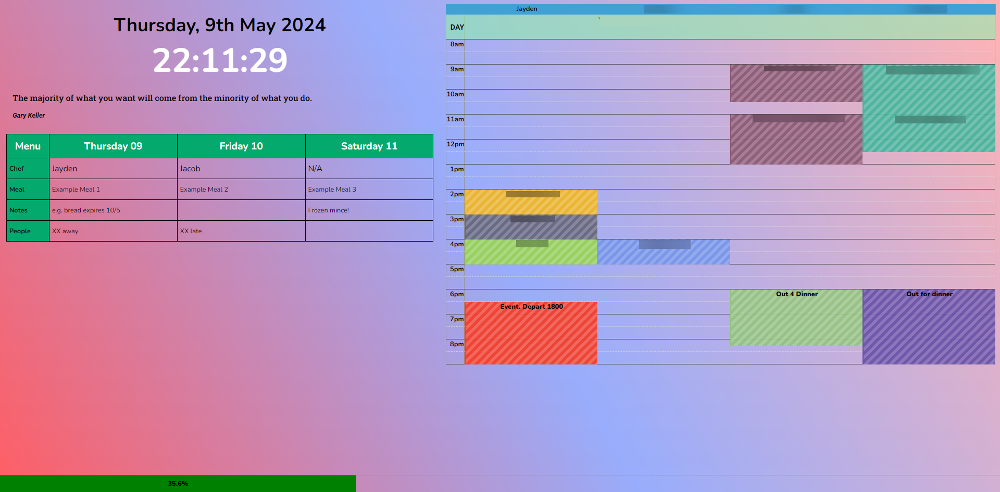

# j4dash

Dashboard for the J^4 flat.
Runs on a flask python backend. No frameworks used - raw html, css, js.

## Quickstart Guide

### Generate Credentials

Duplicate `example_credentials.py` and rename to `credentials.py`. Fill out fields as comments describe.

Ensure colour JavaScript file is also completed.

## Publish website on Google App Engine

Once setup, simply run `gcloud app deploy` in the root directory and the website will publish!

## Credit

- [@Excigma](https://github.com/Excigma) for constant support, rubber duckying, and JS & CSS mentoring.
- [Clean Start](https://cleanstart.page/) for inspiration
